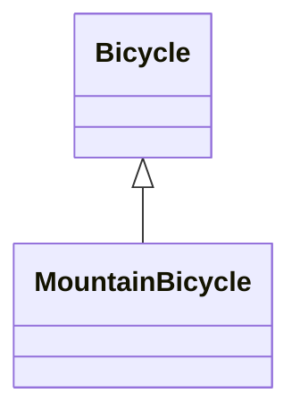

## bicycle_1
種類として、Mountainが追加された

↓

`spares`メソッドをcallする際、インスタンス変数の`style`を条件にして条件分岐

↓

- これをすると有害な影響が現れる
  - 新たなstyleを追加するときはif文を変更しなければならない
  - 最後の選択肢がデフォルトとなるような無頓着なコードを書いた場合想定しない`style`は「何か」をするが、おそらくそれは想定する動作ではない
  - ↑ それ固有の値になっていない
  - sparesメソッドでは同じ文字列が存在してる
  - もはやBicycleクラスの責任は1つにとどまらない

- オブジェクトのクラスを確認し、そのオブジェクトに対して何のメッセージを送るのかを決定している
- `style`は`Bicycle`のインスタンスを実質2分する
  - 振る舞いの大部分を共有するがstyleという面では異なっている
  - 相違はあるけれど関連はしている型をいくつか内包している
  - ↑ 継承が解決する問題(共通の振る舞いを持つものの、いくつかの面においては異なるという強く関連した型の問題を解決する)

- 継承
  - 2つのオブジェクトが関係を持つように定義することができる
  - 1つ目のオブジェクトがメッセージを受け取り、理解できないものだった場合それが理解できないものだった場合自動的に転送つまり委譲を行い、2つ目のオブジェクトに渡せるようになる

- Mountain Bicycleは、Bicycleを特化したもの -> 継承を使って解決することができる

## bicycle2
- super: スーパークラスのチェーンを登っていき渡される
  - ex: MountainBicycleのinitializeメソッドにてsuperを送るとBicycleのinitializeメソッドを実行する
  - この例だと実行後に無理やりmergeしてる
- この例だと、Bicycleは`具象クラス`のままでしかなく、サブクラスが作られるようには書かれていない
  - 不必要なものまで継承されている状態
  - RoadBicycleの振る舞いがBicycleに含まれてしまっているから

↑ 抽象を見つける必要がある
