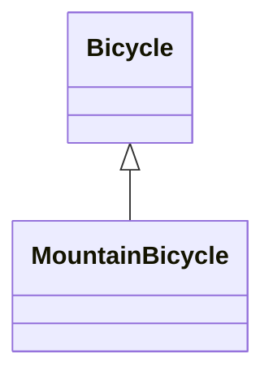

## bicycle_1
種類として、Mountainが追加された

↓

`spares`メソッドをcallする際、インスタンス変数の`style`を条件にして条件分岐

↓

- これをすると有害な影響が現れる
  - 新たなstyleを追加するときはif文を変更しなければならない
  - 最後の選択肢がデフォルトとなるような無頓着なコードを書いた場合想定しない`style`は「何か」をするが、おそらくそれは想定する動作ではない
  - ↑ それ固有の値になっていない
  - sparesメソッドでは同じ文字列が存在してる
  - もはやBicycleクラスの責任は1つにとどまらない

- オブジェクトのクラスを確認し、そのオブジェクトに対して何のメッセージを送るのかを決定している
- `style`は`Bicycle`のインスタンスを実質2分する
  - 振る舞いの大部分を共有するがstyleという面では異なっている
  - 相違はあるけれど関連はしている型をいくつか内包している
  - ↑ 継承が解決する問題(共通の振る舞いを持つものの、いくつかの面においては異なるという強く関連した型の問題を解決する)

- 継承
  - 2つのオブジェクトが関係を持つように定義することができる
  - 1つ目のオブジェクトがメッセージを受け取り、理解できないものだった場合それが理解できないものだった場合自動的に転送つまり委譲を行い、2つ目のオブジェクトに渡せるようになる

- Mountain Bicycleは、Bicycleを特化したもの -> 継承を使って解決することができる

## bicycle2
- super: スーパークラスのチェーンを登っていき渡される
  - ex: MountainBicycleのinitializeメソッドにてsuperを送るとBicycleのinitializeメソッドを実行する
  - この例だと実行後に無理やりmergeしてる
- この例だと、Bicycleは`具象クラス`のままでしかなく、サブクラスが作られるようには書かれていない
  - 不必要なものまで継承されている状態
  - RoadBicycleの振る舞いがBicycleに含まれてしまっているから

↑ 抽象を見つける必要がある

## bicycle3
- 継承のルール
  - モデル化しているオブジェクトが`一般-特殊`の関係を持っている
  - 正しいコーディングテクニックを使っていること

- Bicycleが定義するのはすべての自転車が共有するもの
  - **Bicycleクラスに対して`new`メッセージを送ることは考えられない**
  - そのクラスを直接インスタンス化することはない
  - Javaとかだったらabstractを使うことによってこれを防げたりする
  - 抽象クラスはサブクラスが作られるためだけに存在する

- サブクラスを1つだけ持つ抽象的なスーパークラスを作るのはまったく持って意味をなさない
  - 他のサブクラスを持つことになると思ったとしてもその日は永遠に来ない可能性がある
  - 具体的な要求が出てきて初めて必要になるもの
  - 2種類になってもすぐに継承する必要はない
  - 3種類になるまで引き延ばして、そこにたどり着いて初めて`正しい抽象`を得ることができる可能性が高い

今回の例では2種類の自転車しかないが、階層構造を作るのに十分な理由があると仮定する

まずは`Bicycle`をそのまま`RoadBicycle`に変更して、それぞれ空の`Bicycle`を継承するようにしてみる

## bicycle4
sizeとsparesメソッドはすべての自転車に共通する

↑ この振る舞いはBicycleのパブリックインターフェースに属している

=> 現在はRoadBicycleの下に置かれているため、Bicycleに持ち上げるようにする

`「全てを具象クラスに対して下げて、その中のいくつかを引き上げる」のが戦略として有効`
- 継承の難しさの多くは抽象から具象を厳密に分けることに失敗することによって生じる
  - 仮に元の`Bicycle`からリファクタリングを始め、具象的なコードを分離して`RoadBicycle`クラスに押し下げるとする
  - => 失敗すると具体的な危険物をスーパークラスに残すことになる
  - いったん具象クラスに全てを下げて、そこから抽象クラスのエッセンスを抽出するようにすればいい
  - 本来は具象クラスをそれぞれ作って、共通エッセンスを抽象クラスにあげる
    - 必要なものがなくなることがないから危険度も低い
- 新たな継承の階層構造へとリファクタリングをする際には抽象を昇格できるようにコードを構成するべきであり、具象を降格するような構成にはすべきでない

## bicycle5
現状`RoadBicycle`も`MountainBicycle`も独自のsparesメソッドを実装している

↑ `RoadBicycle`は`Bicycle`からコピーしたものであるため、問題なく動くが`MountainBicycle`はsuperメソッドを実装しているため動かない

=> 抽象クラスBicycleにsparesメソッドを実装する必要がある

- `RoadBicyle`の実装をそのまま`Bicycle`あげるだけというほど単純ではない
  - 現状の`RoadBicycle`の`spares`は知識を持ちすぎている
  - `chain`と`tire_size`はすべての自転車に共通するが、`tape_color`はRoadBicycleだけが知るべき
  - 抽象は`Bicycle`に昇格させ、具象は`RoadBicycle`に残す
  - `chain`と`tire_size`を昇格させる
  - ↑ `size`と同様に属性である(変数)ため、ハードコードされるべきものではない
